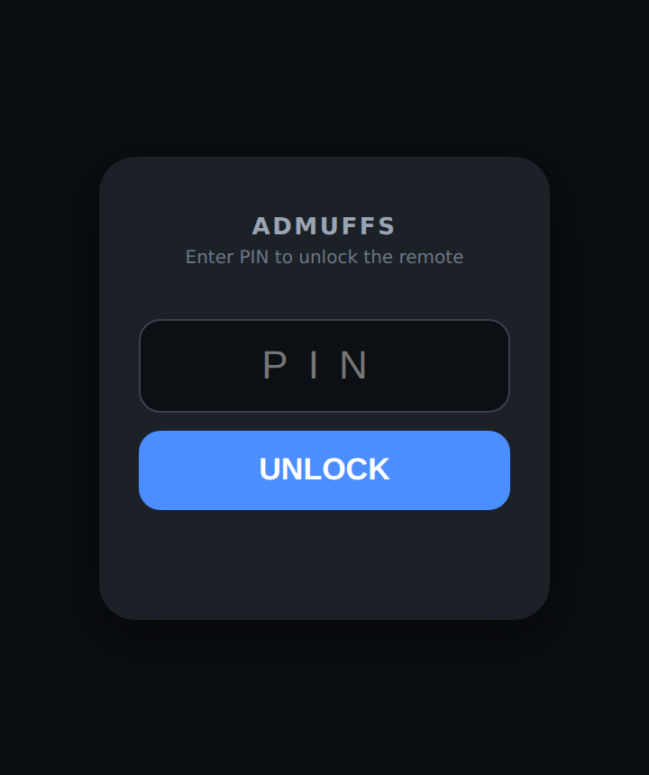
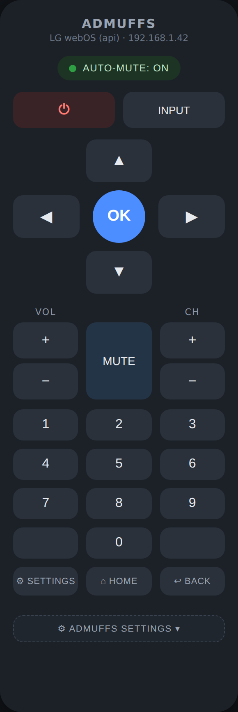
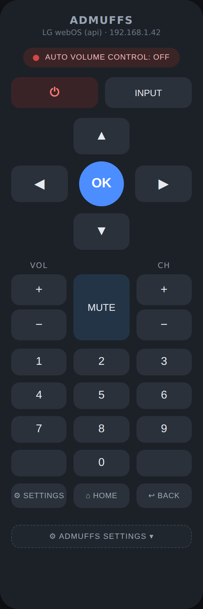
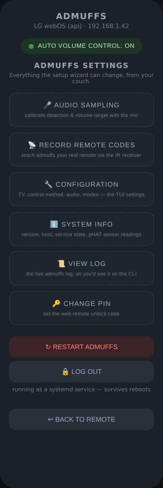
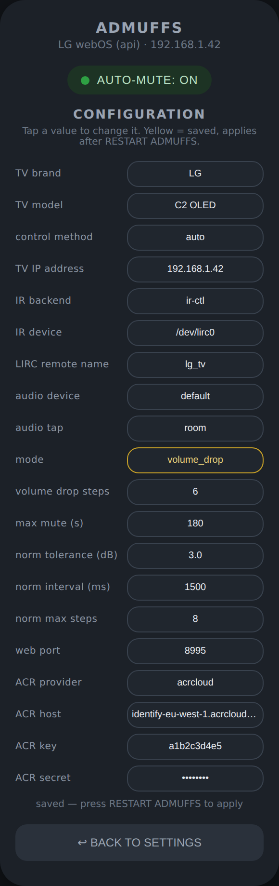
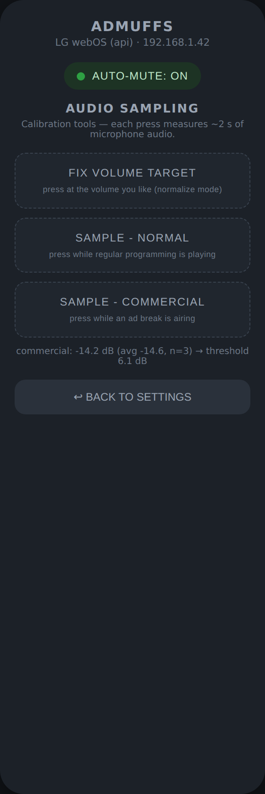
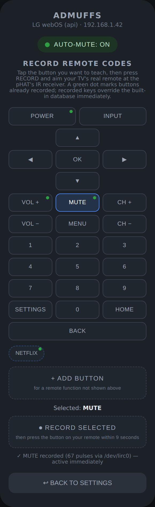
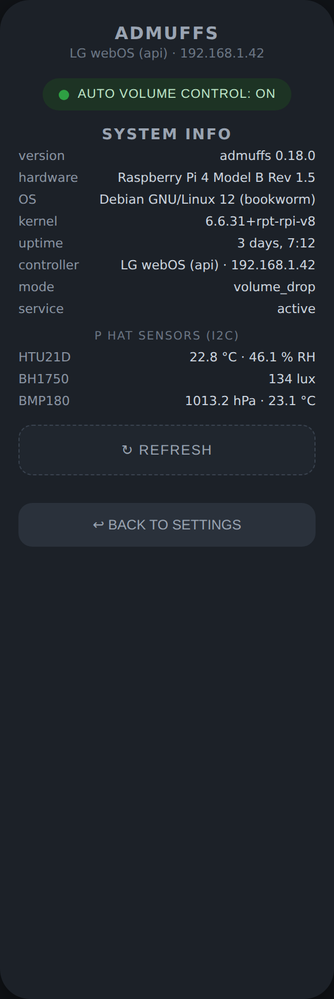
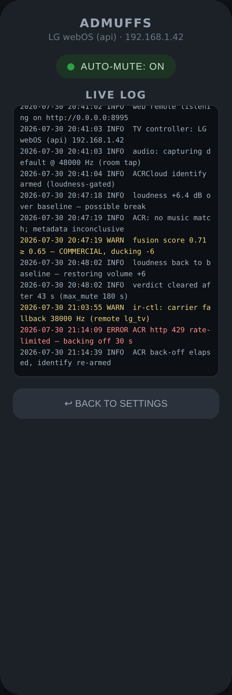

# admuffs

Control your TV via web remote, with the capability to automatically drop volume/normalize or mute TV commercials from a Raspberry Pi with an [ANAVI Infrared pHAT](https://www.crowdsupply.com/anavi-technology/infrared-phat). Please note, the ANAVI Infrared pHAT is **NOT** required if your TV can be controlled over the network/API. 

## How commercial detection works

Admuffs listens to an audio signal for ad breaks, and when it decides a commercial is
airing it lowers or mutes the TV volume — over the TV's LAN API when one is reachable, and over
infrared (via the ANAVI pHAT) as a universal fallback. When the program
resumes, it unmutes.

The Infrared pHAT can only **send and receive IR**. It has no view of what's on
the screen or in the audio, so "know when a commercial is on" has to come from a
separate signal. admuffs uses a **layered, sensor-fusion detector** — several
weak signals combined into one confident decision, so it degrades gracefully:

| Layer | What it does | Status in this build | Needs |
|-------|--------------|----------------------|-------|
| **Loudness / silence** | Flags sustained loudness jumps above a rolling baseline — the classic ad-break tell. Fast, fully local. | **Implemented** (ALSA capture + RMS/dBFS analysis) | A USB mic or line-in |
| **ACR (audio fingerprinting)** | Samples the mic every ~20 s and asks ACRCloud whether the audio matches a bucket of known ad recordings. A match is near-ground-truth "commercial". | **Implemented** (ACRCloud `/v1/identify`, HMAC-SHA1 signed) | USB mic + an [ACRCloud](https://www.acrcloud.com/) project with a custom *ads bucket* |
| **External metadata** | A data feed that reports ad breaks for what's being watched — ground truth when available. | **Stub** with wiring points | A metadata subscription |

All audio consumers share a single **AudioBus** (one ALSA capture thread with a
15 s ring buffer), so loudness and ACR never fight over the microphone.

### The mute paradox (read this before choosing where to plug in audio)

Muting the TV silences the very signal a room microphone detects with — so a
naive loop would mute, hear its own silence, decide "the program is back",
and unmute into the ad. admuffs deals with this four ways, selected by
`audio_tap` and `mute_mode`:

1. **Room mic + volume drop (`mute_mode=volume_drop`, the default)** — instead of muting,
   volume drops `drop_steps` steps. The mic keeps hearing the (quieter) ad;
   admuffs measures the attenuation, compensates the detector, and restores
   volume when the program genuinely resumes. This is the default because
   the default audio input is a room mic, and volume drop is the only mode where a
   mic can time the restore correctly. With an upstream tap, switch to
   `mute_mode=mute` for fully silent ads (the wizard recommends the right
   one for your tap).
2. **Volume normalization (`mute_mode=normalize`)** — a different philosophy:
   don't silence ads, *level* them. admuffs continuously nudges the TV volume
   (VolumeUp/Down over the API or IR) so the room's smoothed loudness tracks
   a target you set. Open the web remote, get the TV to the volume you like,
   and press **FIX VOLUME TARGET** — that sampled level becomes the mean the
   normalizer holds. Loud commercials get pulled down within a few seconds;
   quiet program content comes back up. Safeguards: a ±`norm_tolerance_db`
   deadband (default 3 dB) prevents constant fiddling, one step per
   `norm_interval_ms` keeps corrections gentle, `norm_max_range` (default 12
   steps) bounds drift from your set volume, a silence floor stops it from
   cranking the volume during dialogue pauses or when the TV is off, and the
   net adjustment is unwound when AUTO VOLUME CONTROL is toggled off or admuffs exits.
3. **Upstream tap (`audio_tap=upstream`)** — feed detection from
   *before* the TV (source line-out, HDMI audio extractor, or TV optical-out).
   Detection hears the broadcast while the TV is silent; unmute timing is
   exact and signal-driven. No paradox at all.
4. **Room mic + mute (`audio_tap=room`, `mute_mode=mute`)** — while muted,
   audio-based "program" verdicts are discarded (they'd be measuring our own
   mute) and the TV unmutes on the `max_mute_s` failsafe timer (default
   240 s, roughly an ad-break length). Because that timer is the *only* way
   out, the setup wizard doesn't offer Mute when you pick a room mic — this
   combination can only be set by editing the config file directly, and
   Admuffs logs a warning at startup when it sees it.

The failsafe timer applies in mute and volume-drop modes as an upper bound:
admuffs never stays muted/dropped longer than `max_mute_s` without a positive program
signal, and it always restores audio on shutdown.

Each layer emits a confidence score; the `FusionEngine` combines them (weighted)
and applies **hysteresis** so the TV only reacts to a *sustained* decision, not a
one-second spike. With no mic and no subscription, admuffs still runs on loudness
alone. Add a mic → it gets smarter. Add a data feed → it gets accurate.

This release ships the full architecture, all the TV-control paths, and two
working detection layers (loudness + ACR). The metadata layer remains a stub
with a clear `TODO` at the function to implement (`src/detect/sources.cpp`).

### Setting up ACR (optional but recommended) - NOT TESTED

1. Create an ACRCloud project ("Audio & Video Recognition") and a **custom
   bucket**; upload recordings of the commercials you want recognized (national
   spots repeat constantly, so the bucket pays for itself quickly).
2. Put the project's host / access key / access secret into the setup wizard
   (step 7) or the config file (`acr_provider=acrcloud`, `acr_host`, `acr_key`,
   `acr_secret`).
3. A `custom_files` match ⇒ strong *commercial* vote; "no result" against an
   ads-only bucket ⇒ weak *program* vote; a plain music-catalog match is
   treated as neutral.

## Supported and Implemented

- **TUI setup wizard** (ncurses): pick brand/model, discover the TV on the LAN,
  pair, choose IR backend, pick the audio input, and send a live test mute.
- **TV control abstraction** with a network API path per brand and a universal
  IR fallback, auto-selected at runtime:
  - **Roku** — ECP (`POST :8060/keypress/VolumeMute`), no auth
  - **Samsung Tizen** — WebSocket remote (`KEY_MUTE`); plaintext `ws://:8001`
    for older sets and TLS `wss://:8002` for newer ones, with automatic
    fallback and pairing-token capture + persistence
  - **LG webOS** — SSAP WebSocket (`ssap://audio/setMute`, with pairing)
  - **Sony Bravia** — IRCC-IP SOAP + audio REST (pre-shared key)
  - **Vizio SmartCast** — paired REST key commands (`:7345`)
  - **Infrared** — LIRC (`irsend`) or kernel rc-core (`ir-ctl`), driven by a
    local JSON code database
- **IR code database** — JSON per brand (`data/ir_codes/`), LIRC button names or
  raw carrier+pulse sequences, easy to extend. Ships profiles for Samsung,
  LG, Sony, Vizio, Roku, TCL, Toshiba (NEC), Panasonic (Kaseikyo),
  Magnavox/Philips (RC5) — plus JVC, Sharp, Sanyo, RCA, Emerson, Zenith, and
  Hisense as record-your-remote targets, covering older non-network sets.
  The wizard lists common brands first with the rest under "Other...".
- **Layered detector + fusion engine** with debounce/hysteresis.
- **Web remote** — while `admuffs --run` is active, a browser-based remote is
  served on port 8995 (Power, D-pad + OK, Back, Home, Settings,
  digits 0–9, Vol ±, Ch ±, Mute, Input), plus an AUTO VOLUME CONTROL toggle,
  loudness-calibration sampling buttons, and a FIX VOLUME TARGET button for
  normalize mode. Every press goes through the same control path as the automatic ad handling:
  network API when reachable, IR fallback otherwise.

## Hardware

- Raspberry Pi (any 32/64-bit ARM model with a 40-pin header)
- ANAVI Infrared pHAT (IR LED transmitter + IR receiver). Optional butrequired if your TV cannot be controlled via the network/.   API.
- USB microphone placed near the TV speakers (for
  loudness detection and, later, ACR)
- Line of sight from the pHAT's IR LED to the TV

### Enabling the pHAT's IR transceiver (required, one-time)

The ANAVI Infrared pHAT's IR LED and receiver are plain GPIO devices — the
kernel only creates `/dev/lirc*` for them when the IR overlays are enabled.
Add these two lines to `/boot/firmware/config.txt`:

```ini
[all]
dtoverlay=gpio-ir,gpio_pin=18
dtoverlay=gpio-ir-tx,gpio_pin=17
```

then **reboot** (overlays only load at boot) and confirm with
`admuffs --ir-check`. Two placement rules matter:

- Use `/boot/firmware/config.txt` — the legacy `/boot/config.txt` is just a
  compatibility stub on current Raspberry Pi OS.
- The lines must **not** sit under a model-specific section header like
  `[cm5]` or `[pi4]`. The stock file *ends* with such sections, so naively
  appending puts the overlays where your board never reads them — keep them
  under `[all]` (or above any bracketed section).

(I²C in `raspi-config` is only for the pHAT's optional plug-in sensors — the
IR transceiver does not use I²C.)

See [docs/HARDWARE.md](docs/HARDWARE.md) for wiring, audio-tap options, and
how to record IR codes for your remote. A **3D-printable case** for the
Pi 4 + pHAT (including the sensor-equipped variant) is in `hardware/case/`
— STLs ready to slice, parametric OpenSCAD source, and print/assembly notes
in [docs/CASE.md](docs/CASE.md).

## Build

admuffs builds on **Linux** (Raspberry Pi OS / Debian / Ubuntu, ARM and x86)
and on **macOS** (Apple Silicon and Intel). Linux is the deployment platform —
IR transmit/receive, microphone capture, I²C sensors, and the systemd service
are Linux kernel interfaces. A macOS build is fully functional for network TV
control (Roku / Samsung / LG / Sony / Vizio APIs), the web remote, and the
setup wizard; the hardware-bound features report themselves unavailable
instead of failing.

### Required packages

On Debian / Raspberry Pi OS / Ubuntu:

```bash
sudo apt-get install -y build-essential cmake pkg-config \
     libcurl4-openssl-dev libncurses-dev libasound2-dev libssl-dev \
     lirc v4l-utils
```

| Package | Provides | Needed for |
|---|---|---|
| `build-essential` | gcc/g++, make | compiling |
| `cmake` | build system | compiling |
| `pkg-config` | library discovery | CMake finding ncurses/ALSA |
| `libcurl4-openssl-dev` | libcurl headers | TV network APIs, ACR upload |
| `libncurses-dev` | ncurses headers | the setup wizard TUI |
| `libasound2-dev` | ALSA headers | microphone capture (loudness/ACR) |
| `libssl-dev` | OpenSSL headers | `wss://` (newer Samsung), ACR signing |
| `lirc` | `irsend` + daemon | IR transmit, LIRC backend (runtime) |
| `v4l-utils` | `ir-ctl` | IR transmit, rc-core backend (runtime) |

> **Using the LIRC (`irsend`) backend? One config edit is mandatory.** Debian's
> stock `/etc/lirc/lirc_options.conf` sets `driver = devinput`, which is
> receive-only — `irsend` fails with `hardware does not support sending` no
> matter what. Set `driver = default` and `device = /dev/lircX` (the TRANSMIT
> device reported by `admuffs --ir-check`), then
> `sudo systemctl restart lircd`. Details in
> [docs/HARDWARE.md](docs/HARDWARE.md). The `ir-ctl` backend is unaffected —
> it bypasses lircd entirely.

### Compile

```bash
cmake -S . -B build -DCMAKE_BUILD_TYPE=Release
cmake --build build -j$(nproc)
```

### macOS (Apple Silicon or Intel)

Prerequisites: the Xcode Command Line Tools (`xcode-select --install`) provide
the compiler plus system libcurl and ncurses — no other libraries are strictly
required. You also need CMake itself.

**With Homebrew** (recommended — enables TLS to TVs):

```bash
brew install cmake openssl@3
cmake -S . -B build -DCMAKE_BUILD_TYPE=Release
cmake --build build -j$(sysctl -n hw.ncpu)
```

CMake finds Homebrew's OpenSSL automatically (both `/opt/homebrew` on Apple
Silicon and `/usr/local` on Intel are searched, plus MacPorts' `/opt/local`).

**Without Homebrew:** install CMake from
[cmake.org/download](https://cmake.org/download/) (or any other way), then run
the same two `cmake` commands. The build automatically falls back to Apple's
built-in **CommonCrypto** for hashing/signing and the system CSPRNG — no
OpenSSL needed. The one difference: **TLS to TVs (`wss://`) is disabled** in
this configuration, so newer Samsung TVs that require the token pairing on
port 8002, and LG's preferred `wss:3001` path, fall back to their plaintext
ports where available. Roku, Sony, and Vizio use libcurl (system TLS) and are
unaffected. `cmake` prints which mode it picked.

What works in a macOS build: network TV control, discovery, the web remote and
settings hub (PIN auth included), ACR signing, and the TUI wizard. What
doesn't: IR transmit/receive (`/dev/lirc*` is Linux rc-core), microphone
capture (ALSA), I²C sensors, and `--install-service` (systemd) — each reports
a clear message instead of erroring. Pick `method=api` in the wizard, or
`ir_backend=dryrun` if you just want to exercise the pipeline.

### Install (recommended)

```bash
sudo cmake --install build
```

This puts the binary at `/usr/local/bin/admuffs` and the IR code database at
`/usr/local/share/admuffs/ir_codes`.
The database is searched in this order: an explicit `ir_db_dir` from the
config / `--ir-db`, then `./data/ir_codes` (source checkout), then
`/usr/local/share/admuffs/ir_codes`, then `/usr/share/admuffs/ir_codes`. To add
or edit IR codes on an installed system, edit the JSON under
`/usr/local/share/admuffs/ir_codes/` — changes apply on next start, no rebuild.

The single dependency vendored in-tree is `third_party/json.hpp`
(nlohmann/json). It compiles the same on x86 for development and on ARM for the
Pi.

## Usage

```bash
./build/admuffs --setup        # first-run TUI wizard (writes ~/.config/admuffs/admuffs.conf)
./build/admuffs --run          # start auto-muting
./build/admuffs --test-mute    # send one mute+unmute to verify TV control
./build/admuffs --list-tvs     # show brands/models in the IR database
./build/admuffs --discover     # scan the LAN for TVs (SSDP)
./build/admuffs --ir-check     # diagnose the IR hardware + transmit path
./build/admuffs --dry-run --run  # run without touching IR hardware (logs actions)
```

Run `./build/admuffs --setup` first. With no config file, plain `admuffs` defaults
to setup; once configured, it defaults to `--run`. A sample config is in
[config/admuffs.example.conf](config/admuffs.example.conf).

## Web remote & settings hub

<table>
  <tr>
    <td align="center" valign="top" width="33%">
      <br>
      <b>Unlock (PIN gate)</b><br>
      <sub>PIN-protected; default <code>0000</code>, lockout on repeated misses.</sub>
    </td>
    <td align="center" valign="top" width="33%">
      <br>
      <b>Main remote</b><br>
      <sub>Full TV remote; status line shows the live control path.</sub>
    </td>
    <td align="center" valign="top" width="33%">
      <br>
      <b>Auto volume control toggle</b><br>
      <sub>Tap the pill to pause automatic ad handling (red = off).</sub>
    </td>
  </tr>
  <tr>
    <td align="center" valign="top">
      <br>
      <b>ADMUFFS SETTINGS</b><br>
      <sub>Everything the setup wizard does, from the couch.</sub>
    </td>
    <td align="center" valign="top">
      <br>
      <b>Configuration</b><br>
      <sub>Tap to change; yellow = saved, applies on restart.</sub>
    </td>
    <td align="center" valign="top">
      <br>
      <b>Audio sampling</b><br>
      <sub>Fix Volume Target (recommended) + loudness calibration.</sub>
    </td>
  </tr>
  <tr>
    <td align="center" valign="top">
      <br>
      <b>Record remote codes</b><br>
      <sub>Capture your real remote via the pHAT's IR receiver.</sub>
    </td>
    <td align="center" valign="top">
      <br>
      <b>System info</b><br>
      <sub>Version, host, service state, live I²C sensor readings.</sub>
    </td>
    <td align="center" valign="top">
      <br>
      <b>Live log</b><br>
      <sub>The CLI log in the browser; warnings/errors highlighted.</sub>
    </td>
  </tr>
</table>

<sub>Screens shown with representative data (LG C2 over webOS, volume-drop mode). For a
single-page annotated walkthrough, see
[`docs/web-remote-screens.html`](docs/web-remote-screens.html) — open it locally,
or view it rendered via
<a href="https://htmlpreview.github.io/">htmlpreview.github.io</a> without cloning.</sub>

While `admuffs --run` is active, open `http://<pi-address>:8995/` from any
phone or laptop on your LAN to get a graphical remote for the configured TV.
Buttons: Power, Input, D-pad with OK, Back, Home, Settings, volume and
channel rockers, Mute, and a numeric keypad. A press flashes green when the command was sent and red when
it failed; the header shows which control path is live (e.g. `LG webOS
(192.168.1.9) -> IR (LG (generic), ir-ctl)`).

The **AUTO VOLUME CONTROL** pill at the top toggles automatic ad handling
on/off — tap it to pause the detection loop's control of the TV (green = on,
red = off). The rest of the
remote keeps working while paused, and toggling mid-commercial keeps the TV
consistent (disabling unmutes; re-enabling re-mutes). Detection continues in
the background either way, so flipping it back on is instant.

**ADMUFFS SETTINGS** (the dashed button under the keypad) opens a hub with:

- **Audio Sampling** — **FIX VOLUME TARGET (recommended)**: fix the volume at
  its current level for normalize mode; plus the loudness-calibration Sample
  buttons.
- **Record Remote Codes** — pick a key, press RECORD, and press the button on
  your TV's real remote at the pHAT's IR receiver within 9 seconds. Recorded
  codes are saved to `~/.config/admuffs/recorded_keys.json`, override the
  built-in database for your configured TV, and take effect immediately.
- **Configuration** — every setting the TUI wizard manages (TV
  brand/model/IP, control method, IR backend, audio device/tap, mode, volume-drop
  steps, failsafe timer, normalization tuning, web port, ACR credentials).
  Tap a value to change it: enum values cycle, others prompt. Changes that
  can apply live do; the rest are saved and marked yellow until you press
  **RESTART ADMUFFS**.
- **System Info** — version, hardware model, OS, kernel, uptime, active
  controller, service state, and **live readings from the pHAT's I²C
  sensors** (HTU21D temperature/humidity, BH1750 light, BMP180 pressure).
  I²C runs on GPIO2/3 and the IR transceiver on GPIO17/18 — completely
  independent, so sensors and IR work simultaneously by design.
- **View Log** — the live admuffs log streamed to the browser, exactly what
  the CLI prints (warnings and errors highlighted).
- **Change PIN** — set the web-remote unlock code.
- **Log Out** / **Restart Admuffs** — end your session; clean restart (the
  systemd service brings it right back).

### Security

The web remote is PIN-protected (default **`0000`** — change it under ADMUFFS
SETTINGS before exposing the Pi on a shared network). Sessions use HttpOnly
cookies with a brute-force lockout; the PIN is stored only as a salted
SHA-256 hash; IR runs without a shell; all inputs are validated; and every
response carries OWASP security headers. It is a LAN appliance with no TLS —
don't port-forward it. Full details in [SECURITY.md](SECURITY.md).

## Run at boot (systemd service)

```bash
sudo admuffs --install-service     # installs + enables + starts the unit
```

This writes `/etc/systemd/system/admuffs.service` pointing at the installed
binary with `Restart=always`, so admuffs starts on boot, recovers from
crashes, and the web remote's RESTART button performs a clean cycle. Check on
it with `systemctl status admuffs` / `journalctl -u admuffs -f`, and remove
it with `sudo admuffs --uninstall-service`. The settings hub shows whether
you're running under the service.

Presses use the active controller with per-command fallback: if the TV's API
lacks a command (LG's SSAP has no D-pad; Roku's ECP has no input cycle), that
press automatically drops to infrared. Set `web_port` in the config to move
it, or `web_port=0` to disable. There is no authentication — anyone on your
LAN can press buttons, the same trust model as an IR remote in the room; do
not port-forward it.

### Audio sampling from the remote

**FIX VOLUME TARGET (recommended)** — the top button on the Audio Sampling
panel fixes the volume at its current level. Get the TV to the volume you
like and press it: that sampled room level becomes the target the normalizer
holds, pulling loud ads down and quiet program content back up
(`mute_mode=normalize`). One press is all it takes, which is why it comes
first — start here before the per-label sampling below.

The two Sample buttons below it — **Sample - Normal** and
**Sample - Commercial** — teach the detector what *your* room actually sounds
like. Press Sample - Normal while ordinary programming is playing, and
Sample - Commercial while an ad break is airing (a few presses of each, on
different shows/ads, is ideal). Each press measures ~2 seconds of microphone
audio, folds it into a running average for that label, and persists it to the
config. Once both labels have at least one sample, the loudness trigger
threshold is derived from the measured normal-vs-commercial dB gap (60% of
the gap, bounded to 1.5–12 dB), replaces the hand-tuned
`loudness_delta_db`, and takes effect immediately — no restart. The status
line under the buttons shows each measurement and the resulting threshold,
and the calibration survives restarts.

## Tuning detection

In the config file:

- `loudness_delta_db` — how many dB above the rolling baseline counts as "louder"
  (default 4.0). Lower = more sensitive. Overridden automatically once you
  calibrate with the web remote's Sample buttons (see above).
- `fire_threshold` — fused confidence needed to act (0..1, default 0.6).
- `mute_debounce_ms` / `unmute_debounce_ms` — how long a decision must hold
  before muting / unmuting (defaults 1500 / 2500 ms).

## Project layout

```
src/net/       HTTP (libcurl), minimal WebSocket client, SSDP discovery
src/ir/        IR code database (JSON) + transmitter (irsend / ir-ctl)
src/tv/        TvController interface, per-brand API controllers, IR fallback, factory
src/detect/    detection-source interface, loudness/ACR/metadata sources, fusion engine
src/tui/       ncurses setup wizard
src/web/       embedded web remote (port 8995)
src/app.*      detection -> mute run loop
data/ir_codes/ the IR code database
docs/          hardware + architecture notes
```

See [docs/ARCHITECTURE.md](docs/ARCHITECTURE.md) for how the pieces fit and how
to add a brand or a detection source.

## Roadmap

1. Implement the metadata source (feed polling for the active channel/stream).
2. Optional HDMI-capture detector (black-frame / logo / silence on-device).
3. On-device fingerprint pre-filter to cut ACR API calls (only query on a
   loudness-flagged transition).

## License

admuffs is released under the [MIT License](LICENSE) — free to use, modify, and
redistribute, including commercially, with attribution. Every source file
carries an `SPDX-License-Identifier: MIT` header.

### Third-party components

admuffs bundles and links a handful of open-source libraries, each under its own
permissive license:

| Component | Use | License |
|-----------|-----|---------|
| [nlohmann/json](https://github.com/nlohmann/json) | JSON parsing (vendored at `third_party/json.hpp`) | MIT |
| [OpenSSL](https://www.openssl.org/) | TLS + crypto (WebSocket `wss://`, HMAC, SHA-256) | Apache-2.0 |
| [libcurl](https://curl.se/libcurl/) | HTTP client (ACRCloud, REST TV APIs) | curl (MIT-style) |
| [ncurses](https://invisible-island.net/ncurses/) | TUI setup interface | MIT-style (X11) |
| [ALSA](https://www.alsa-project.org/) | Audio capture | LGPL-2.1 (linked at runtime) |

Only nlohmann/json is redistributed in this repository (a single header, which
retains its own MIT notice). The rest are system libraries linked at build time;
install them from your distribution as listed under **Requirements**.

## Legal / etiquette note

This controls your own TV in your own home. Muting is a viewer-side action, the
same as picking up the remote. It does not modify, redistribute, or circumvent
any broadcast or stream. Skipping ads on services whose terms forbid it is on
you to check.
